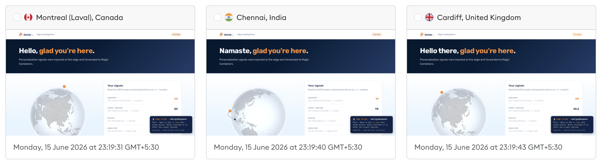
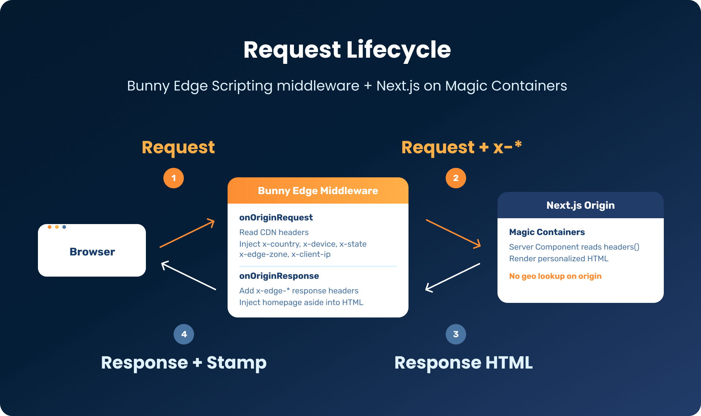
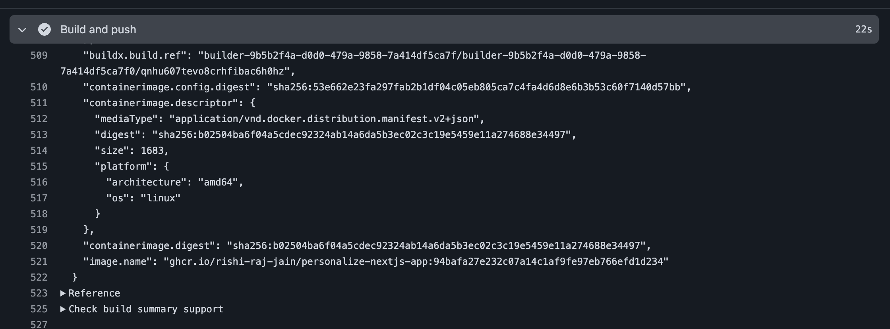
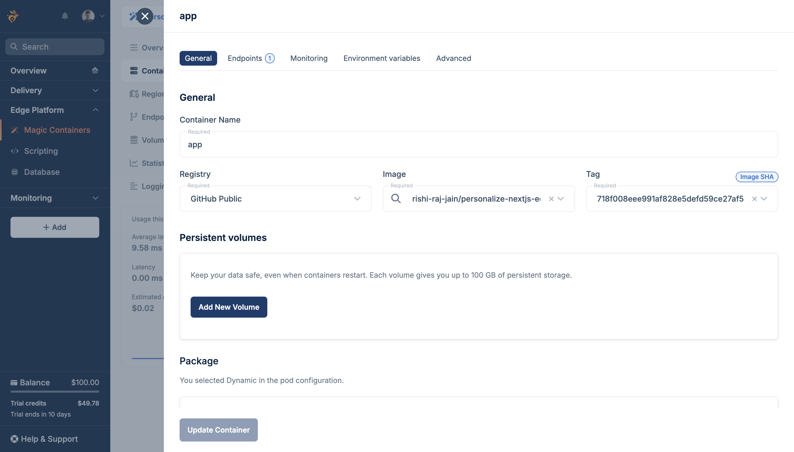
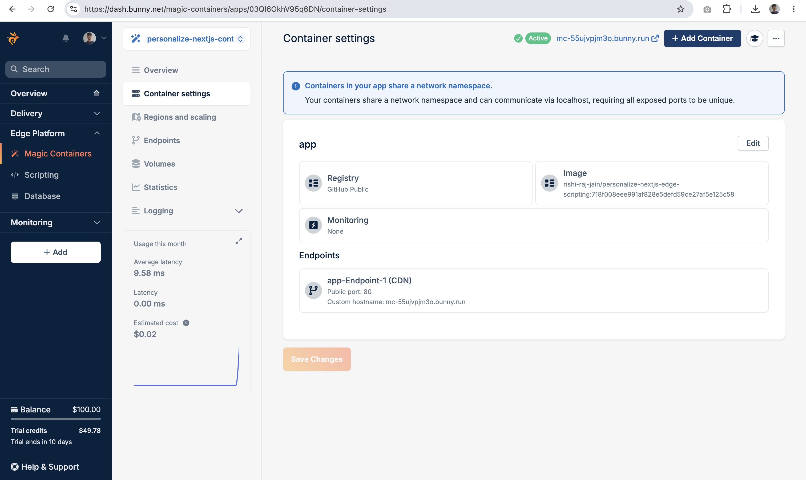
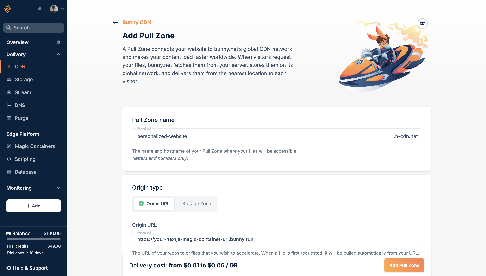
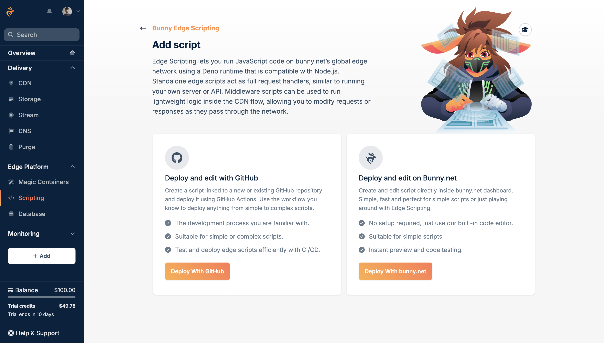
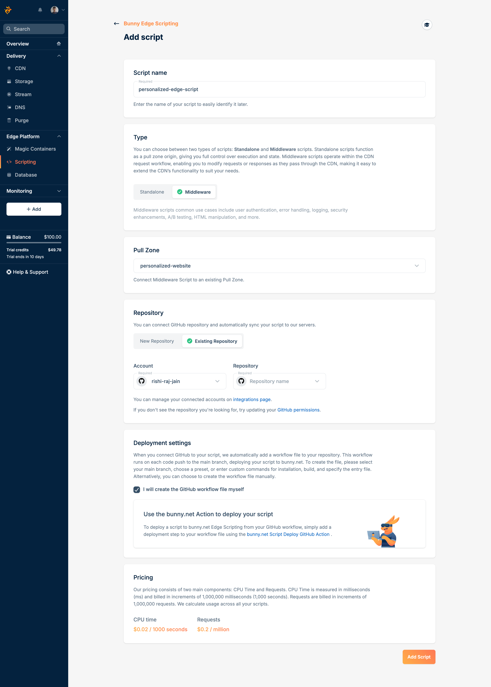
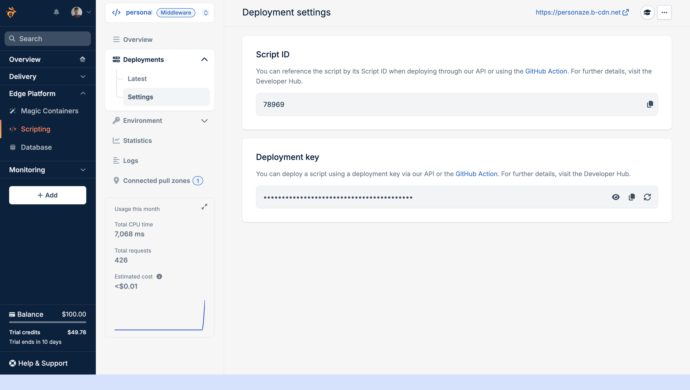
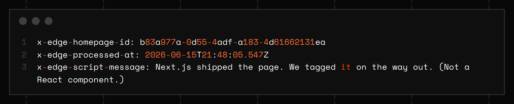

When building personalized web experiences, the two most common approaches are either placing the personalization logic entirely on the client side, which causes users to briefly see generic content before JavaScript updates the page, or running the personalization on the origin server, which adds unnecessary latency while every request waits for a round trip. But there’s a third, better way: use [Bunny Edge Scripting](https://bunny.net/edge-scripting/) to make personalization decisions at the CDN edge. This way, your Next.js app receives requests that are already personalized: no flicker, no added latency, and a lighter load on your origin. In this guide, you’ll learn how to personalize Next.js with Bunny Edge Scripting.

In this guide, you will build two separate projects in two GitHub repositories: a Next.js 16 app deployed to [Bunny Magic Containers](https://docs.bunny.net/magic-containers), and a [Bunny Edge Scripting](https://docs.bunny.net/scripting) middleware deployed on its own Pull Zone in front of that app. The middleware injects `x-*` request headers from CDN signals and stamps the homepage HTML on the way back with [onOriginResponse](https://docs.bunny.net/scripting/middleware/overview#middleware-methods).

## Demo

Let's start by taking a look at what's covered in this guide. The [live app](https://personaze.b-cdn.net/) runs behind a Bunny Pull Zone with Edge Scripting middleware in front of a Next.js 16 app on Magic Containers. When you open the demo, you should see a country-specific greeting, a COBE globe focused on your region and edge POP, a signals panel listing every `x-*` header the middleware injected, and a fixed aside in the bottom-right corner that the edge script added that Next.js did not render.

https://github.com/user-attachments/assets/9d5079f0-8fd5-4196-ac8a-6d5d6f94cfce

The screenshot below shows the same app opened from three locations at once (Montreal, Chennai, and Cardiff), each with a localized greeting, region-specific CDN signals, and the edge-injected aside.



Reference implementations for both projects are in separate GitHub repositories: [personalize-nextjs-app](https://github.com/rishi-raj-jain/personalize-nextjs-app) and [personalize-edge-script](https://github.com/rishi-raj-jain/personalize-edge-script).

## Prerequisites

To follow along in this guide, you will need the following:

- [Node.js 20](https://nodejs.org/en) or later
- A [Bunny.net](https://bunny.net) account
- A [GitHub](https://github.com) account

## Project layout

You will maintain two repositories. The Next.js app and the Edge Script do not share a folder or a GitHub repo, but they connect in production through the Pull Zone origin URL.

**Repository 1: Next.js app** (`personalize-nextjs-app`)

```
personalize-nextjs-app/
├── app/
│   ├── page.tsx
│   ├── layout.tsx
│   ├── globals.css
│   └── components/
│       └── UserGlobe.tsx
├── lib/
│   ├── country-greetings.ts
│   └── locations.ts
├── Dockerfile
├── next.config.ts
└── .github/workflows/
    └── deploy-nextjs-app.yml
```

**Repository 2: Edge Script middleware** (`personalize-edge-script`)

```
personalize-edge-script/
├── script.ts
├── deno.json
└── .github/workflows/
    └── deploy-edge-script.yml
```

## How edge personalization works

When a user requests a page, the request arrives at Bunny CDN first, and if a middleware Edge Script is attached to that Pull Zone, it runs before the request is forwarded to your origin server.



The diagram above shows the full round trip. An orange arrow marks each outgoing request, including the hop from the edge middleware to Next.js with injected `x-*` headers. A navy arrow marks each response on the way back, ending with the stamped HTML the browser receives.

[`onOriginRequest`](https://docs.bunny.net/scripting/middleware/overview#onoriginrequest) reads the following signals from the incoming request:

| Signal             | Header name                  | Fallback / Notes                            |
|--------------------|-----------------------------|---------------------------------------------|
| Country           | `cdn-requestcountrycode`     | Fallback: `cf-ipcountry` (for local dev)    |
| State / region    | `cdn-requeststatecode`       |                                             |
| Device            | `cdn-mobiledevice`           | Fallback: `User-Agent` regex (for dev)      |
| Edge POP          | `cdn-serverzone`             |                                             |
| Client IP         | `x-real-ip` or `x-forwarded-for` |                                         |

The script rewrites the request by adding `x-*` headers before forwarding it to Next.js, where your Server Components read those headers via `headers()` and render the personalized response.

[`onOriginResponse`](https://docs.bunny.net/scripting/middleware/overview#onoriginresponse) runs on the way back, and for homepage `GET` requests that return HTML, the script adds response headers and injects a small fixed aside into the HTML body that Next.js does not know about, because the edge script appended it after the origin (i.e. Next.js) replied.

Because request personalization happens at the CDN edge, Next.js never needs to do a geo lookup or parse a User-Agent string on its own.

## Create the Next.js application

Create a new GitHub repository for the Next.js app (for example, `personalize-nextjs-app`), then scaffold the Next.js project locally:

```bash
mkdir personalize-nextjs-app
cd personalize-nextjs-app
npx create-next-app@latest . --typescript --tailwind --app --no-src-dir
```

Next, enable standalone output in `next.config.ts` so the app can be containerized:

```typescript
// File: next.config.ts

import type { NextConfig } from "next";

const nextConfig: NextConfig = {
  output: "standalone",
};

export default nextConfig;
```

Next, run the following comamnd to install [COBE](https://github.com/shuding/cobe) for the interactive globe:

```bash
npm install cobe
```

### Configure Tailwind CSS (Optional)

To get a similar theming like the [live demo](#demo), update `app/globals.css` with the following branded tokens and utility classes:

```css
/* File: app/globals.css */

@import url("https://fonts.bunny.net/css2?family=Rubik:wght@300;400;500;600;700&display=swap");
@import "tailwindcss";

@theme {
  --font-sans: "Rubik", ui-sans-serif, system-ui, sans-serif;
  --color-bunny-navy: #223c6a;
  --color-bunny-navy-dark: #051e38;
  --color-bunny-navy-deep: #03192e;
  --color-bunny-navy-text: #183d6d;
  --color-bunny-orange: #fd8d32;
  --color-bunny-orange-light: #ffaf48;
  --color-bunny-pink: #ff2a64;
  --color-bunny-sky: #e1f2ff;
  --color-bunny-sky-light: #e5f4ff;
  --color-bunny-blue-mid: #4a74a2;
}

@layer utilities {
  .bg-bunny-hero {
    background: linear-gradient(
      135deg,
      var(--color-bunny-navy-deep) 0%,
      var(--color-bunny-navy-dark) 45%,
      var(--color-bunny-navy) 100%
    );
  }

  .bg-bunny-section {
    background: linear-gradient(
      0deg,
      var(--color-bunny-sky) 0%,
      var(--color-bunny-sky-light) 41%,
      #ffffff 100%
    );
  }

  .text-bunny-stat {
    color: var(--color-bunny-orange);
  }
}
```

Similar to matcht the background theming, update `app/layout.tsx` with the following code:

```typescript
// File: app/layout.tsx

import type { Metadata } from "next";
import "./globals.css";

export const metadata: Metadata = {
  title: "Edge Personalization Demo",
  description: "A Next.js 16 app personalized at the edge with Bunny Edge Scripting",
};

export default function RootLayout({
  children,
}: {
  children: React.ReactNode;
}) {
  return (
    <html lang="en">
      <body className="font-sans bg-white text-bunny-navy-text antialiased">
        {children}
      </body>
    </html>
  );
}
```

### Greet users in their own language

Create a `lib/country-greetings.ts` file with a `getCountryGreeting(countryCode)` helper that maps 80+ ISO country codes to localized greetings, falling back to `"Welcome"` for countries not in the map:

```typescript
// File: lib/country-greetings.ts

export const COUNTRY_GREETINGS: Record<string, string> = {
  // Americas
  US: "Hey there",
  CA: "Hello",
  MX: "Hola",
  BR: "Olá",
  AR: "Hola",
  CL: "Hola",
  CO: "Hola",
  PE: "Hola",
  VE: "Hola",
  EC: "Hola",
  UY: "Hola",
  PY: "Mba'éichapa",

  // Europe
  GB: "Hello there",
  IE: "Dia duit",
  FR: "Bonjour",
  DE: "Hallo",
  ES: "Hola",
  IT: "Ciao",
  PT: "Olá",
  NL: "Hallo",
  BE: "Bonjour",
  CH: "Grüezi",
  AT: "Servus",
  SE: "Hej",
  NO: "Hei",
  DK: "Hej",
  FI: "Hei",
  PL: "Cześć",
  CZ: "Ahoj",
  SK: "Ahoj",
  HU: "Szia",
  RO: "Salut",
  BG: "Zdravey",
  GR: "Yia sou",
  HR: "Bok",
  RS: "Zdravo",
  UA: "Pryvit",
  RU: "Privyet",
  LT: "Labas",
  LV: "Sveiki",
  EE: "Tere",
  IS: "Halló",
  LU: "Moien",
  MT: "Bongu",
  CY: "Yia sou",
  AL: "Përshëndetje",
  BA: "Zdravo",
  MK: "Zdravo",
  SI: "Živjo",

  // Asia-Pacific
  IN: "Namaste",
  PK: "Assalamu alaikum",
  BD: "Nomoshkar",
  LK: "Ayubowan",
  NP: "Namaste",
  CN: "Nǐ hǎo",
  TW: "Nǐ hǎo",
  HK: "Neih hou",
  JP: "Konnichiwa",
  KR: "Annyeonghaseyo",
  SG: "Hello",
  MY: "Selamat",
  ID: "Halo",
  TH: "Sawasdee",
  VN: "Xin chào",
  PH: "Kamusta",
  KH: "Chum reap suor",
  LA: "Sabaidee",
  MM: "Mingalaba",
  MN: "Sain baina uu",
  AU: "G'day",
  NZ: "Kia ora",
  FJ: "Bula",

  // Middle East & Africa
  AE: "Marhaba",
  SA: "Marhaba",
  QA: "Marhaba",
  KW: "Marhaba",
  BH: "Marhaba",
  OM: "Marhaba",
  JO: "Marhaba",
  LB: "Marhaba",
  IL: "Shalom",
  TR: "Merhaba",
  IR: "Salaam",
  IQ: "Marhaba",
  EG: "Marhaba",
  MA: "Salam",
  TN: "Salam",
  DZ: "Salam",
  ZA: "Sawubona",
  NG: "Hello",
  KE: "Jambo",
  GH: "Akwaaba",
  ET: "Selam",
  TZ: "Jambo",
  UG: "Oli otya",
  RW: "Muraho",
  SN: "Nanga def",
  CI: "Bouôn",
  CM: "Bonjour",
  AO: "Olá",
  MZ: "Olá",
};

export function getCountryGreeting(country: string): string {
  return COUNTRY_GREETINGS[country.toUpperCase()] ?? "Welcome";
}
```

### Resolve globe coordinates

Create a `lib/locations.ts` file with `resolveUserCoordinates(country, state)` and `resolveEdgeCoordinates(edgeZone)` helpers so the globe can focus on the visitor region and the edge POP:

```typescript
// File: lib/locations.ts

export type Coordinates = [lat: number, lon: number];

const COUNTRY_COORDS: Record<string, Coordinates> = {
  US: [39.83, -98.58],
  CA: [56.13, -106.35],
  MX: [19.43, -99.13],
  BR: [-23.55, -46.63],
  AR: [-34.6, -58.38],
  CL: [-33.45, -70.67],
  CO: [4.71, -74.07],
  PE: [-12.05, -77.04],
  VE: [10.48, -66.9],
  EC: [-0.18, -78.47],
  UY: [-34.9, -56.16],
  PY: [-25.26, -57.58],
  GB: [51.51, -0.13],
  IE: [53.35, -6.26],
  FR: [48.85, 2.35],
  DE: [51.16, 10.45],
  ES: [40.42, -3.7],
  IT: [41.9, 12.5],
  PT: [38.72, -9.14],
  NL: [52.37, 4.9],
  BE: [50.85, 4.35],
  CH: [46.95, 7.45],
  AT: [48.21, 16.37],
  SE: [59.33, 18.07],
  NO: [59.91, 10.75],
  DK: [55.68, 12.57],
  FI: [60.17, 24.94],
  PL: [52.23, 21.01],
  CZ: [50.08, 14.44],
  SK: [48.15, 17.11],
  HU: [47.5, 19.04],
  RO: [44.43, 26.1],
  BG: [42.7, 23.32],
  GR: [37.98, 23.73],
  HR: [45.81, 15.98],
  RS: [44.79, 20.45],
  UA: [50.45, 30.52],
  RU: [55.75, 37.62],
  LT: [54.69, 25.28],
  LV: [56.95, 24.11],
  EE: [59.44, 24.75],
  IS: [64.15, -21.94],
  LU: [49.61, 6.13],
  MT: [35.9, 14.51],
  CY: [35.17, 33.36],
  AL: [41.33, 19.82],
  BA: [43.85, 18.36],
  MK: [41.99, 21.43],
  SI: [46.05, 14.51],
  IN: [20.59, 78.96],
  PK: [33.69, 73.04],
  BD: [23.81, 90.41],
  LK: [6.93, 79.86],
  NP: [27.72, 85.32],
  CN: [39.9, 116.4],
  TW: [25.03, 121.57],
  HK: [22.32, 114.17],
  JP: [35.68, 139.65],
  KR: [37.57, 126.98],
  SG: [1.35, 103.82],
  MY: [3.14, 101.69],
  ID: [-6.21, 106.85],
  TH: [13.76, 100.5],
  VN: [21.03, 105.85],
  PH: [14.6, 120.98],
  KH: [11.56, 104.93],
  LA: [17.98, 102.63],
  MM: [16.87, 96.2],
  MN: [47.92, 106.91],
  AU: [-33.87, 151.21],
  NZ: [-41.29, 174.78],
  FJ: [-18.14, 178.44],
  AE: [25.2, 55.27],
  SA: [24.71, 46.67],
  QA: [25.29, 51.53],
  KW: [29.38, 47.99],
  BH: [26.23, 50.59],
  OM: [23.59, 58.38],
  JO: [31.95, 35.93],
  LB: [33.89, 35.5],
  IL: [31.77, 35.22],
  TR: [39.93, 32.86],
  IR: [35.69, 51.39],
  IQ: [33.31, 44.37],
  EG: [30.04, 31.24],
  MA: [33.97, -6.85],
  TN: [36.81, 10.18],
  DZ: [36.75, 3.06],
  ZA: [-33.92, 18.42],
  NG: [9.08, 7.53],
  KE: [-1.29, 36.82],
  GH: [5.56, -0.2],
  ET: [9.03, 38.74],
  TZ: [-6.79, 39.28],
  UG: [0.35, 32.58],
  RW: [-1.94, 30.06],
  SN: [14.69, -17.44],
  CI: [5.36, -4.01],
  CM: [3.87, 11.52],
  AO: [-8.84, 13.23],
  MZ: [-25.97, 32.57],
};

const STATE_COORDS: Record<string, Record<string, Coordinates>> = {
  IN: {
    DL: [28.61, 77.23],
    MH: [19.08, 72.88],
    KA: [12.97, 77.59],
    TN: [13.08, 80.27],
    WB: [22.57, 88.36],
  },
  US: {
    CA: [34.05, -118.24],
    NY: [40.71, -74.01],
    TX: [29.76, -95.37],
    FL: [25.76, -80.19],
    WA: [47.61, -122.33],
  },
  AU: {
    NSW: [-33.87, 151.21],
    VIC: [-37.81, 144.96],
    QLD: [-27.47, 153.03],
  },
};

const EDGE_POP_COORDS: Record<string, Coordinates> = {
  SG: [1.35, 103.82],
  SYD: [-33.87, 151.21],
  SY: [-33.87, 151.21],
  NY: [40.71, -74.01],
  LA: [34.05, -118.24],
  LON: [51.51, -0.13],
  LD: [51.51, -0.13],
  FRA: [50.11, 8.68],
  AMS: [52.37, 4.9],
  TOK: [35.68, 139.65],
  JP: [35.68, 139.65],
  BR: [-23.55, -46.63],
  SAO: [-23.55, -46.63],
  JHB: [-26.2, 28.04],
  DXB: [25.2, 55.27],
  MUM: [19.08, 72.88],
  DEL: [28.61, 77.23],
  HK: [22.32, 114.17],
  SEA: [47.61, -122.33],
  CHI: [41.88, -87.63],
  MIA: [25.76, -80.19],
  ATL: [33.75, -84.39],
  DFW: [32.9, -97.04],
  PAR: [48.85, 2.35],
};

export function resolveUserCoordinates(
  country: string,
  state: string
): Coordinates | null {
  const code = country.toUpperCase();
  if (code === "UNKNOWN" || code === "-") return null;

  if (state !== "-") {
    const stateCoords = STATE_COORDS[code]?.[state.toUpperCase()];
    if (stateCoords) return stateCoords;
  }

  return COUNTRY_COORDS[code] ?? null;
}

export function resolveEdgeCoordinates(edgeZone: string): Coordinates | null {
  if (edgeZone === "-") return null;
  return EDGE_POP_COORDS[edgeZone.toUpperCase()] ?? null;
}
```

- The `resolveUserCoordinates` function prefers a state-level pin when one exists (for example `IN` + `TN` for Chennai), then falls back to the country centroid.
- The `resolveEdgeCoordinates` function maps Bunny edge POP codes to map coordinates for the navy marker.

Next, add an `app/components/UserGlobe.tsx` file which would be a client-side component that renders a COBE globe with Bunny marker colors and a one-time rotate animation toward the visitor coordinates:

```typescript
// File: app/components/UserGlobe.tsx

"use client";

import createGlobe, { type COBEOptions } from "cobe";
import { useEffect, useRef } from "react";
import type { Coordinates } from "../../lib/locations";

type UserGlobeProps = {
  userLocation: Coordinates | null;
  edgeLocation: Coordinates | null;
  locationLabel: string;
  edgeLabel?: string;
};

const BUNNY_ORANGE: COBEOptions["markerColor"] = [0.99, 0.55, 0.2];
const BUNNY_NAVY: COBEOptions["markerColor"] = [0.13, 0.24, 0.42];

function locationToAngles([lat, lon]: Coordinates): [number, number] {
  return [
    Math.PI - ((lon * Math.PI) / 180 - Math.PI / 2),
    (lat * Math.PI) / 180,
  ];
}

export default function UserGlobe({
  userLocation,
  edgeLocation,
  locationLabel,
  edgeLabel,
}: UserGlobeProps) {
  const canvasRef = useRef<HTMLCanvasElement>(null);

  useEffect(() => {
    const canvas = canvasRef.current;
    if (!canvas) return;

    let phi = 0;
    let theta = 0.25;
    const size = 480;

    const focusLocation = userLocation ?? edgeLocation;
    const [targetPhi, targetTheta] = focusLocation
      ? locationToAngles(focusLocation)
      : [phi, theta];

    const markers: COBEOptions["markers"] = [];
    const arcs: COBEOptions["arcs"] = [];

    if (userLocation) {
      markers.push({
        location: userLocation,
        size: 0.08,
        color: BUNNY_ORANGE,
      });
    }

    if (edgeLocation) {
      markers.push({
        location: edgeLocation,
        size: 0.05,
        color: BUNNY_NAVY,
      });

      if (userLocation) {
        arcs.push({
          from: userLocation,
          to: edgeLocation,
        });
      }
    }

    const globe = createGlobe(canvas, {
      devicePixelRatio: 2,
      width: size * 2,
      height: size * 2,
      phi,
      theta,
      dark: 0,
      diffuse: 1.2,
      mapSamples: 16000,
      mapBrightness: 6,
      baseColor: [0.92, 0.96, 1],
      markerColor: BUNNY_ORANGE,
      glowColor: [0.88, 0.94, 1],
      markers,
      arcs,
      arcColor: [0.13, 0.24, 0.42],
      arcWidth: 0.4,
      arcHeight: 0.25,
    });

    let frame: number;
    const animate = () => {
      const distPhi = targetPhi - phi;
      const distTheta = targetTheta - theta;

      if (Math.abs(distPhi) < 0.002 && Math.abs(distTheta) < 0.002) {
        globe.update({ phi: targetPhi, theta: targetTheta, markers, arcs });
        return;
      }

      phi += distPhi * 0.06;
      theta += distTheta * 0.06;
      globe.update({ phi, theta, markers, arcs });
      frame = requestAnimationFrame(animate);
    };
    animate();

    return () => {
      cancelAnimationFrame(frame);
      globe.destroy();
    };
  }, [userLocation, edgeLocation]);

  return (
    <div className="flex flex-col items-center justify-center">
      <div className="relative w-full max-w-[480px] aspect-square">
        <canvas
          ref={canvasRef}
          className="w-full h-full"
          style={{ width: "100%", height: "100%", contain: "layout paint size" }}
        />
      </div>
      <div className="mt-4 space-y-2 text-center">
        {userLocation ? (
          <p className="text-sm font-medium text-bunny-navy">
            <span className="inline-block w-2 h-2 rounded-full bg-bunny-orange mr-2 align-middle" />
            You · {locationLabel}
          </p>
        ) : (
          <p className="text-sm text-bunny-navy/50">Location unavailable</p>
        )}
        {edgeLocation && edgeLabel && (
          <p className="text-sm text-bunny-navy/70">
            <span className="inline-block w-2 h-2 rounded-full bg-bunny-navy mr-2 align-middle" />
            Edge POP · {edgeLabel}
          </p>
        )}
      </div>
    </div>
  );
}
```

The code above now marks the orange marker as the visitor, the navy marker as the edge POP, and the arc between them shows how far the request traveled before Next.js rendered the page.

### Show personalized content from injected headers

Update the `app/page.tsx` file with a Server Component that reads the edge-injected headers and renders the demo UI:

```typescript
// File: app/page.tsx

import { headers } from "next/headers";
import Image from "next/image";
import UserGlobe from "./components/UserGlobe";
import { getCountryGreeting } from "../lib/country-greetings";
import {
  resolveEdgeCoordinates,
  resolveUserCoordinates,
} from "../lib/locations";

type Signal = {
  label: string;
  value: string;
  source: string;
  highlight?: boolean;
};

function StatRow({ label, value, source, highlight }: Signal) {
  return (
    <div className="flex items-start justify-between gap-4 py-4 border-b border-bunny-sky last:border-0">
      <div className="min-w-0">
        <p className="text-xs text-bunny-navy/50 uppercase tracking-wider font-semibold mb-1">
          {label}
        </p>
        <p className="text-xs text-bunny-navy/40 font-mono">{source}</p>
      </div>
      <p
        className={`text-lg font-bold shrink-0 text-right break-all ${
          highlight ? "text-bunny-stat" : "text-bunny-navy capitalize"
        }`}
      >
        {value}
      </p>
    </div>
  );
}

export default async function Home() {
  const headersList = await headers();

  const country = headersList.get("x-country") || "unknown";
  const state = headersList.get("x-state") || "-";
  const device = headersList.get("x-device") || "desktop";
  const edgeZone = headersList.get("x-edge-zone") || "-";
  const clientIp = headersList.get("x-client-ip") || "-";

  const greeting = getCountryGreeting(country);
  const location =
    state !== "-" ? `${country.toUpperCase()} · ${state}` : country.toUpperCase();

  const userCoords = resolveUserCoordinates(country, state);
  const edgeCoords = resolveEdgeCoordinates(edgeZone);

  const signals: Signal[] = [
    {
      label: "Country",
      value: country.toUpperCase(),
      source: "cdn-requestcountrycode → x-country",
      highlight: true,
    },
    {
      label: "State / Region",
      value: state,
      source: "cdn-requeststatecode → x-state",
    },
    {
      label: "Device",
      value: device,
      source: "cdn-mobiledevice → x-device",
      highlight: true,
    },
    {
      label: "Edge POP",
      value: edgeZone,
      source: "cdn-serverzone → x-edge-zone",
      highlight: true,
    },
    {
      label: "Client IP",
      value: clientIp,
      source: "x-real-ip → x-client-ip",
    },
  ];

  return (
    <main className="min-h-screen flex flex-col">
      {/* header, hero, globe + signals panel, footer */}
    </main>
  );
}
```

In the code above:

- `await headers()` is the Next.js 16 async headers API that reads the incoming request headers inside a Server Component at render time.
- Each signal has a safe fallback so the page still renders when accessed directly without the Edge Script in front of it, such as during `npm run dev`.
- The greeting uses the two-letter ISO country code from `x-country` via `getCountryGreeting()`, and each stat row shows the upstream CDN header alongside the `x-*` header the middleware injected.

Start the development server from the Next.js app repository:

```bash
npm run dev
```

Now, open `http://localhost:3000`, where fallback values will be shown until an Edge Script is injecting headers in front of the app.

## Write the Edge Scripting middleware

Create a second GitHub repository for the middleware (for example, `personalize-edge-script`), then create the project locally:

```bash
mkdir personalize-edge-script
cd personalize-edge-script
```

Create a `deno.json` file at the repository root to configure Deno for the Edge Script project:

```json
{
  "imports": {
    "@bunny.net/edgescript-sdk": "npm:@bunny.net/edgescript-sdk@^0.12.1"
  },
  "compilerOptions": {
    "lib": ["deno.window", "deno.ns", "dom", "esnext"]
  }
}
```

Next, create a `script.ts` file at the repository root with the following code which inspects the incoming requests, enriches them with geo and device information via custom headers, and appends a response stamp aside for homepage HTML responses.

```typescript
// File: script.ts

import * as BunnySDK from "@bunny.net/edgescript-sdk";

const MOBILE_UA_RE =
  /Mobile|Android|iPhone|iPad|iPod|BlackBerry|IEMobile|Opera Mini/i;

function getDevice(
  userAgent: string,
  cdnMobileDevice: string | null
): string {
  if (cdnMobileDevice === "true") return "mobile";
  if (cdnMobileDevice === "false") return "desktop";
  return MOBILE_UA_RE.test(userAgent) ? "mobile" : "desktop";
}

function setIfPresent(headers: Headers, key: string, value: string | null) {
  if (value) headers.set(key, value);
}

function isHomepage(url: string): boolean {
  const { pathname } = new URL(url);
  return pathname === "/" || pathname === "";
}

function homepageResponseStamp() {
  return {
    id: crypto.randomUUID(),
    processedAt: new Date().toISOString(),
    message:
      "Next.js shipped the page. We tagged it on the way out. (Not a React component.)",
  };
}

function buildHomepageStampHtml(stamp: {
  id: string;
  processedAt: string;
  message: string;
}): string {
  const shortId = stamp.id.slice(0, 8);
  return `<aside id="edge-homepage-stamp" data-edge-id="${stamp.id}" data-edge-processed-at="${stamp.processedAt}" aria-label="Edge script response stamp" style="position:fixed;bottom:1rem;right:1rem;z-index:50;max-width:18rem;padding:0.75rem 1rem;border-radius:0.625rem;background:#0F2348;color:#fff;font:500 11px/1.45 ui-monospace,monospace;box-shadow:0 4px 16px rgba(15,35,72,.3);border:1px solid rgba(255,112,41,.35)"><div style="font-weight:700;font-size:12px;margin-bottom:0.35rem"><span style="color:#FF7029">🐰 Edge Script</span> · onOriginResponse</div><div style="color:rgba(255,255,255,.85);margin-bottom:0.35rem">Psst: Next.js has <em style="font-style:normal;color:#FF7029">no idea</em> this aside exists. Bunny stitched it in after the origin replied.</div><div style="color:rgba(255,255,255,.55);font-size:10px">${shortId}… · ${stamp.processedAt}</div></aside>`;
}

BunnySDK.net.http
  .servePullZone({ url: "https://your-next-app.bunny.run" })
  .onOriginRequest((ctx) => {
    const req = ctx.request;
    const ua = req.headers.get("user-agent") ?? "";
    const country =
      req.headers.get("cdn-requestcountrycode") ??
      req.headers.get("cf-ipcountry") ??
      "unknown";
    const state = req.headers.get("cdn-requeststatecode");
    const device = getDevice(ua, req.headers.get("cdn-mobiledevice"));
    const modifiedHeaders = new Headers(req.headers);
    modifiedHeaders.set("x-country", country);
    modifiedHeaders.set("x-device", device);
    setIfPresent(modifiedHeaders, "x-state", state);
    setIfPresent(
      modifiedHeaders,
      "x-edge-zone",
      req.headers.get("cdn-serverzone")
    );
    setIfPresent(
      modifiedHeaders,
      "x-client-ip",
      req.headers.get("x-real-ip") ?? req.headers.get("x-forwarded-for")
    );
    return Promise.resolve(
      new Request(req.url, {
        method: req.method,
        headers: modifiedHeaders,
        body: req.method !== "GET" && req.method !== "HEAD" ? req.body : null,
      })
    );
  })
  .onOriginResponse(async (ctx) => {
    const req = ctx.request;
    if (!isHomepage(req.url) || req.method !== "GET") {
      return ctx.response;
    }
    const stamp = homepageResponseStamp();
    const newHeaders = new Headers(ctx.response.headers);
    newHeaders.set("x-edge-homepage-id", stamp.id);
    newHeaders.set("x-edge-processed-at", stamp.processedAt);
    newHeaders.set("x-edge-script-message", stamp.message);
    const contentType = newHeaders.get("content-type") ?? "";
    if (!contentType.includes("text/html")) {
      return new Response(ctx.response.body, {
        status: ctx.response.status,
        statusText: ctx.response.statusText,
        headers: newHeaders,
      });
    }
    const html = await ctx.response.text();
    const stampHtml = buildHomepageStampHtml(stamp);
    const body = html.includes("</body>")
      ? html.replace("</body>", `${stampHtml}</body>`)
      : `${html}${stampHtml}`;
    return new Response(body, {
      status: ctx.response.status,
      statusText: ctx.response.statusText,
      headers: newHeaders,
    });
  });
```

In the code above:

- The `.onOriginRequest` handler:
  - Reads geo (`cdn-requestcountrycode`, `cdn-requeststatecode`) and device (`cdn-mobiledevice`) headers provided by Bunny CDN in production.
  - Forwards these as custom `x-country`, `x-state`, and `x-device` headers to Next.js, so your Server Components can easily read them via the `headers()` API.
  - Forwards along any relevant edge information such as edge POP (`cdn-serverzone`) and client IP (`x-real-ip` or `x-forwarded-for`) as headers.

- The `.onOriginResponse` handler:
  - Adds custom response headers for homepage HTML responses, such as `x-edge-homepage-id`, `x-edge-processed-at`, and `x-edge-script-message`.
  - Injects a fixed aside element (the "badge") into the `<body>` of homepage (`/`) HTML responses, helping verify that edge processing is active. This aside is appended *after* Next.js rendering, so it does not affect React or hydration.

- `servePullZone({ url: "..." })` should only be used in development to simulate your CDN Pull Zone origin. In production, the Bunny dashboard determines routing.

In production, there's no need for your app to handle geo lookups or device detection. It's all handled at the edge and provided as headers. The injected headers make it trivial to personalize content on the server.

## Containerize the Next.js app

Create a `Dockerfile` at the Next.js application project root with the following code. The build compiles the Next.js standalone output, and copies only the necessary artifacts into the final image:

```dockerfile
# File: Dockerfile

FROM node:22-alpine AS base
WORKDIR /app

FROM base AS deps
COPY package*.json ./
RUN npm install

FROM deps AS build
COPY . .
RUN npm run build

FROM base AS runner

ENV NODE_ENV=production

COPY --from=build /app/.next/standalone ./
COPY --from=build /app/.next/static ./.next/static

ENV PORT=80
ENV HOSTNAME=0.0.0.0
EXPOSE 80

CMD ["node", "server.js"]
```

Note that the build does not require any environment variables because the Edge Script injects personalization headers at runtime and Next.js reads them from the incoming request.

Next, create a `.dockerignore` file in the Next.js app repository with the following code:

```
node_modules
.next
.env
.env.*
```

## Deploy the Next.js application and Edge Script

You will deploy each project from its own GitHub repository. The Next.js repo builds and publishes a Docker image to Magic Containers. The Edge Script repo deploys middleware to Bunny Edge Scripting. They connect in the Bunny dashboard when you point the Pull Zone origin at your Magic Containers URL.

### Push the initial image of the Next.js application

In the **Next.js app repository**, create `.github/workflows/deploy-nextjs-app.yml`:

```yaml
# File: .github/workflows/deploy-nextjs-app.yml

name: Deploy Next.js App

on:
  workflow_dispatch:
  push:
    branches: [main]

env:
  REGISTRY: ghcr.io
  IMAGE_NAME: ${{ github.repository }}

jobs:
  build-and-push:
    runs-on: ubuntu-latest
    permissions:
      contents: read
      packages: write

    steps:
      - uses: actions/checkout@v4

      - uses: docker/setup-buildx-action@v3

      - uses: docker/login-action@v3
        with:
          registry: ${{ env.REGISTRY }}
          username: ${{ github.actor }}
          password: ${{ secrets.GITHUB_TOKEN }}

      - name: Build and push
        uses: docker/build-push-action@v6
        with:
          context: .
          push: true
          platforms: linux/amd64
          provenance: false
          sbom: false
          tags: ${{ env.REGISTRY }}/${{ env.IMAGE_NAME }}:${{ github.sha }}
```

Push a commit to `main` in the Next.js app repository to trigger the first build. Wait for the "Build and push" step to complete. The workflow output shows the full image name and tag that you will paste into Magic Containers:



### Create the Magic Containers app for Next.js

To deploy your Docker container on Bunny, open the [Bunny dashboard](https://dash.bunny.net), go to **Edge Platform > Magic Containers > Add Your First App**. Enter an app name and click **Next Step**.

Now, click **Add Container** and configure the container as follows:

- Set the container name to `app`
- Select **GitHub Public registry**
- Set the image name to your Next.js app repository path, for example `rishi-raj-jain/personalize-nextjs-app`
- Set the image tag to the commit SHA from your latest GitHub Actions run



Click **Add endpoint** and leave environment variables empty for now. Click **Add Container**, then **Next Step**, then **Confirm and Create**.



While the container is being deployed, copy the following value:

- **App ID** from the URL in the browser (here, `OVo4i13ouUJ2Tn1`)

### Enable automatic deploys of the Next.js app

Add these secrets to the **Next.js app repository** under **Settings > Secrets and variables > Actions**:

```
BUNNYNET_API_KEY    → your [Bunny API key](https://dash.bunny.net/account/api-key)
APP_ID          → the App ID from the Magic Containers URL
```

Now that the app exists and the secrets are in place, add the Magic Containers update step to your GitHub workflow and push to Git:

```yaml
      - name: Deploy to Magic Containers
        uses: BunnyWay/actions/container-update-image@main
        with:
          container: app
          app_id: ${{ secrets.APP_ID }}
          image_tag: "${{ github.sha }}"
          api_key: ${{ secrets.BUNNYNET_API_KEY }}
```

With all that done, every future push to `main` builds a new image, pushes it to GHCR, and rolls it out on Magic Containers.

### Deploy the Edge Script

#### Create a Pull Zone

In the Bunny dashboard, go to **Delivery > CDN** and click **Add Pull Zone**.

1. Enter a **Pull Zone name** (for example, `personalized-website`). Bunny assigns a hostname such as `personalized-website.b-cdn.net`.
2. Under **Origin type**, select **Origin URL**.
3. Set **Origin URL** to your Magic Containers deployment URL (for example, `https://your-nextjs-magic-container-url.bunny.run`).
4. Click **Add Pull Zone**.



#### Create the middleware script from GitHub

Go to **Edge Platform > Scripting** and click **Add script**. On the **Add script** page, choose **Deploy With GitHub**.



Then, complete the form with:

1. **Script name:** Enter a name for the middleware (for example, `personalized-edge-script`).
2. **Type:** Select **Middleware**. Middleware runs inside the CDN request flow so you can modify requests before they reach the origin.
3. **Pull Zone:** Attach the Pull Zone you created above (for example, `personalized-website`).
4. **Repository:** Under **Existing Repository**, connect your GitHub account and select the **edge script repository** (for example, `personalize-edge-script`).
5. **Deployment settings:** Check **I will create the GitHub workflow file myself**. This guide adds `.github/workflows/deploy-edge-script.yml` in the edge script repository in the next step instead of using the auto-generated workflow.
6. Click **Add Script**.



#### Copy the Script ID and Deployment key

Open your script in the dashboard, go to **Deployments > Settings**, and copy:

- **Script ID** (for example, `78969`)
- **Deployment key** (click the reveal icon, then copy)

Store these as `SCRIPT_ID` and `DEPLOY_KEY` in the GitHub secrets step below. The **Deployments > Settings** page also shows the Pull Zone hostname (for example, `https://personaze.b-cdn.net`) where the middleware will serve traffic once deployed.



Before configuring a GitHub Action to automate deployments of the edge script, add these secrets to the **edge script repository** under **Settings > Secrets and variables > Actions**:

```
SCRIPT_ID    → Script ID from Deployments > Settings
DEPLOY_KEY   → Deployment key from Deployments > Settings
```

Now that the script exists and the secrets are in place, create `.github/workflows/deploy-edge-script.yml` in the **edge script repository**:

```yaml
# File: .github/workflows/deploy-edge-script.yml

name: Deploy Edge Script

on:
  workflow_dispatch:
  push:
    branches: [main]

jobs:
  deploy:
    runs-on: ubuntu-latest

    steps:
      - uses: actions/checkout@v4

      - name: Deploy Script to Bunny Edge Scripting
        uses: BunnyWay/actions/deploy-script@main
        with:
          script_id: ${{ secrets.SCRIPT_ID }}
          deploy_key: ${{ secrets.DEPLOY_KEY }}
          file: "script.ts"
```

Push to `main` in the edge script repository whenever you update the middleware, and the deploy workflow will publish the new script automatically.

## Verify in production

Open your Pull Zone hostname in a browser (here, https://personaze.b-cdn.net). You should see:

- A country-specific greeting and device badge in the header
- The COBE globe focused on your region
- Edge signals (country, state, device, edge POP, client IP) in the panel
- A fixed aside in the bottom-right corner that says Next.js did not create it

Check response headers on the homepage with curl:

```bash
curl -sI "https://your-script.b-cdn.net/" | grep -i x-edge
```



You should see `x-edge-homepage-id`, `x-edge-processed-at`, and `x-edge-script-message` confirming the response hook ran at the edge. To simulate different CDN signals during local development, pass `cdn-requestcountrycode`, `cdn-requeststatecode`, and `cdn-mobiledevice` headers in your curl command.

## Summary

In this guide, you built two separate projects: a Next.js 16 app and a Bunny Edge Scripting middleware. The middleware securely reads geo and device signals from Bunny CDN headers and injects them as `x-*` request headers during `onOriginRequest`, then stamps the homepage HTML at the edge in `onOriginResponse`. This pattern is both safe and fast i.e. personalization decisions are made at the CDN edge where headers can be validated or sanitized, reducing exposure to untrusted client input and improving privacy by not leaking geo data to the browser or storing it in JavaScript-accessible places. Because the CDN edge is geographically close to your end users and the personalization logic runs there, origin requests are fast and already tailored, minimizing latency compared to traditional approaches. The Next.js Server Component simply reads these pre-injected headers at render time, enabling a personalized experience with no client-side geo detection and no extra origin lookups, all while keeping the logic isolated and efficient.
